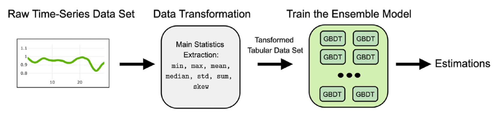



### Cognitive Load

Cognitive load refers to the mental effort required to perform a task. High cognitive load can lead to errors and decreased performance, while low cognitive load can indicate underutilization of cognitive resources. Estimating cognitive load helps in creating systems that respond dynamically to the user’s mental state, improving overall efficiency and user satisfaction.

Understanding cognitive load is crucial for improving human-computer interaction (HCI) applications. By estimating cognitive load, systems can adapt to user needs, enhancing experiences in areas like autonomous vehicles, medical devices, and intelligent tutoring. 

#### Why Estimate Cognitive Load?

- Enhanced User Experience: Adapting interfaces based on cognitive load can reduce user frustration and increase productivity.
- Safety and Efficiency: In critical applications like driving or operating machinery, monitoring cognitive load can prevent accidents caused by cognitive overload.
- Personalized Learning: Intelligent tutoring systems can adjust difficulty levels based on the learner’s cognitive load, optimizing the learning process.

### Data Collection and Preprocessing

The dataset, CogLoad2020, includes physiological measurements from 23 participants performing cognitive tasks of varying difficulty levels. The data is preprocessed using the following steps:

1. Sampling Rate: Measurements are taken at a 1Hz sampling rate.
2. Time Windows: Data is segmented into 30-second windows for analysis.
3. Feature Extraction: Simple aggregate statistics such as mean, standard deviation, and skewness are calculated for each physiological signal within the time window.

The model uses four physiological indicators to estimate cognitive load:

1. Heart Rate (HR): The number of heartbeats per minute.
2. Skin Conductance (SC): Measures sweat gland activity, which varies with stress and cognitive load.
3. R-R Intervals: The time intervals between successive R-waves of the QRS signal on an electrocardiogram.
4. Skin Temperature (ST): Changes in skin temperature can reflect emotional and cognitive states.

### ML Modeling

The dataset is divided into an 80:20 ratio for training and validation.

#### Baseline

The baseline model uses an ensemble of 8 GBDT models based on LightGBM, optimized with random search and Bayesian algorithms. Despite testing more models, the final meta-model averages these 8 models, achieving an accuracy of 62.5%.

#### Experiments

Several machine learning models were tested to estimate cognitive load - Gaussian Naive Bayes (GNB), K-Nearest Neighbors (KNN), Support Vector Machines (SVM), and Neural Networks (NN). The NN model outperformed other methods in estimating cognitive load. The architecture includes a single hidden layer with ReLU activation functions. The Adam optimizer is used with an initial learning rate of 0.001 and the NN is trained for a maximum of 300 epochs on a CPU.

Key NN performance metrics include:
- Accuracy: 67.71%
- ROC-AUC: 65.81%
- F1-Score: 68%

### Conclusion

The neural network model achieved a 5.2% improvement over the baseline model in estimating cognitive load. Future work includes collecting more data and exploring deeper neural network architectures to further enhance accuracy.

The project report can be found [here](CognitiveLoad_NN.pdf)