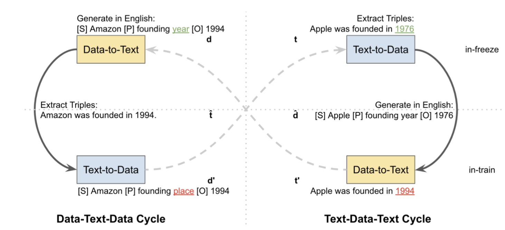



### Introduction

Data-to-text generation transforms structured data into natural language. This is essential for applications like conversational agents, where verbalizing intricate information from databases is necessary. However, achieving high performance in data-to-text generation can be challenging, especially in low-resource settings with limited labelled data-text pairs. A novel approach called cycle training, which leverages pre-trained models like T5, addresses these challenges effectively.

### Cycle Training

Cycle training [(Wang, 2023)](https://aclanthology.org/2023.acl-long.160.pdf) involves two cycles: Data-Text-Data (DTD) and Text-Data-Text (TDT). These cycles ensure consistency between the input data and the generated text. Here's how it works:

1. Data-Text-Data (DTD): Converts data to text and back to data, ensuring that the initial data and the reconstructed data are consistent.
2. Text-Data-Text (TDT): Converts text to data and back to text, ensuring that the initial text and the reconstructed text are consistent.

Cycle training is particularly useful in low-resource settings where annotated data is scarce. By initializing with a small amount of supervised data and then training unsupervised over the entire dataset, it achieves performance comparable to fully supervised methods.

### Methodology

The approach is tested on 5 datasets - WebNLG, E2E, WTQ, WSQL, and XAlign. T5-base, a pre-trained text-to-text transformer with 12 layers and 220M parameters, is used for both data-to-text and text-to-data tasks as the backbone model.

Training setup:
- AdamW optimizer, learning rate of 3e-4, batch size of 32, max input length of 256.
- Models are trained up to 50 epochs with early stopping after 5 epochs without improvement.

### Results

The cycle training method shows impressive results across various datasets, achieving performance nearly identical to fully supervised models. Notably, the T5 model demonstrated exceptional performance, validating the effectiveness of cycle training in data-to-text generation tasks. ROUGE, METEOR, BLEU, BertScore, and PARENT scores were used as performance metrics.

| Dataset | Fully Unsupervised | Low-Resource Finetuning |
|:-------:|:------------------:|:-----------------------:|
| WebNLG  |       36:43        |          0:57           |
| E2E     |       24:58        |          0:43           |
| WTQ     |       2:08         |          0:05           |
| WSQL    |       3:30         |          0:07           |
| XAlign  |       7:45         |          0:12           |

**Table 1**: Average computational time (hours:minutes) for training T5 on each dataset on A40 GPU

Cycle training significantly reduces training time by leveraging pre-trained models and focusing on self-consistency within the data and text cycles. This efficient process minimizes the need for extensive labeled datasets, which are often time-consuming and costly to produce. Here’s how it works:

1. Pre-trained Models: Utilizing models like T5, which have already been trained on vast datasets, provides a strong foundation. This reduces the amount of training required for specific tasks.
2. Small Supervised Data Requirement: Only a small amount of supervised data is needed to initialize the cycle training, further cutting down the initial training time.
3. Efficient Learning Cycles: The DTD and TDT cycles streamline the learning process, ensuring the model learns effectively with fewer epochs compared to traditional methods.

### Conclusion

Cycle training is a powerful technique for data-to-text generation, especially in low-resource environments. It leverages the strengths of pre-trained models and ensures high fidelity between input data and generated text. This method holds promise for improving the performance of conversational agents and other applications requiring natural language generation from structured data.

The project report can be found [here](CycleTraining.pdf)