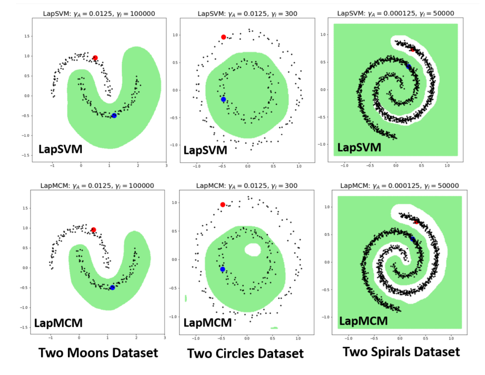
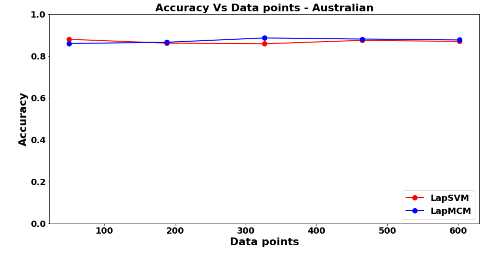
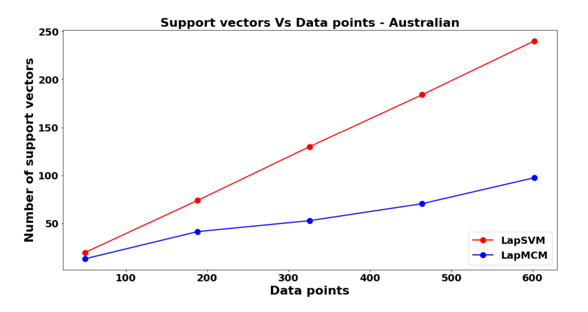
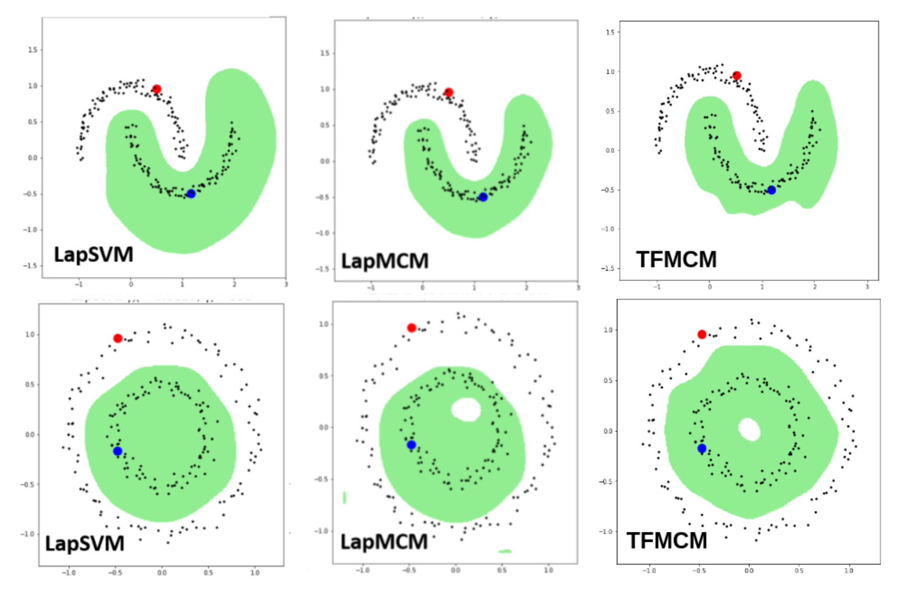
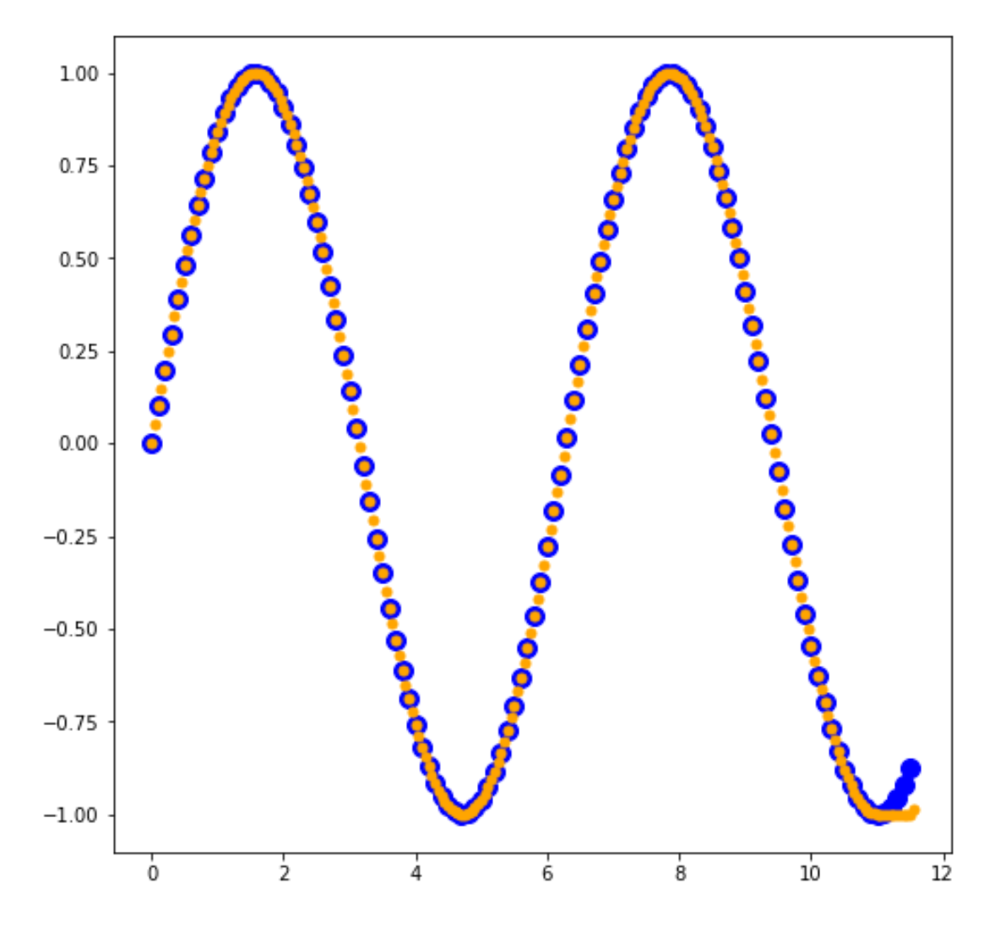
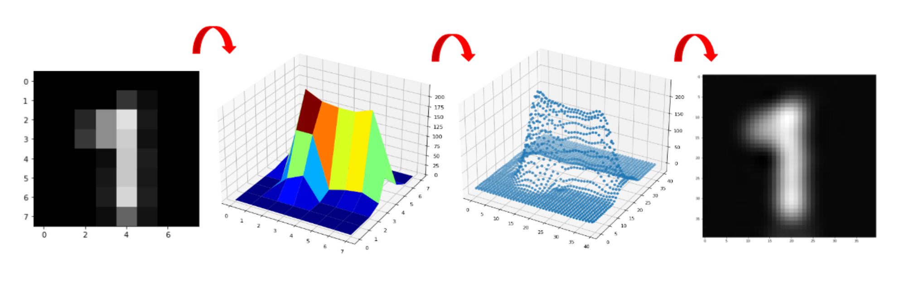
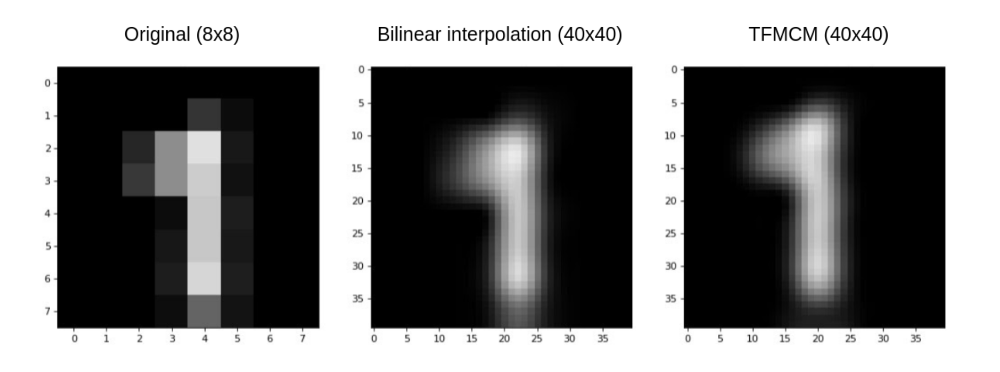
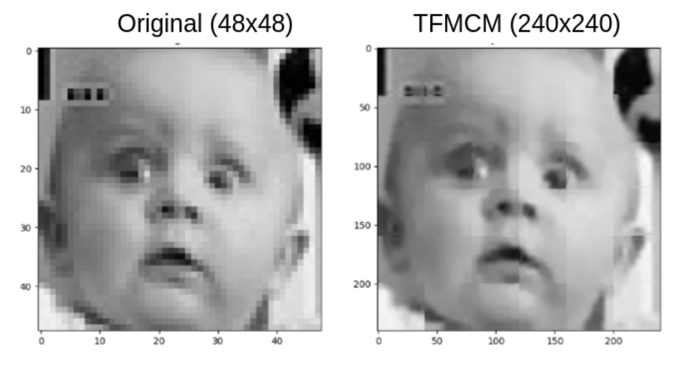
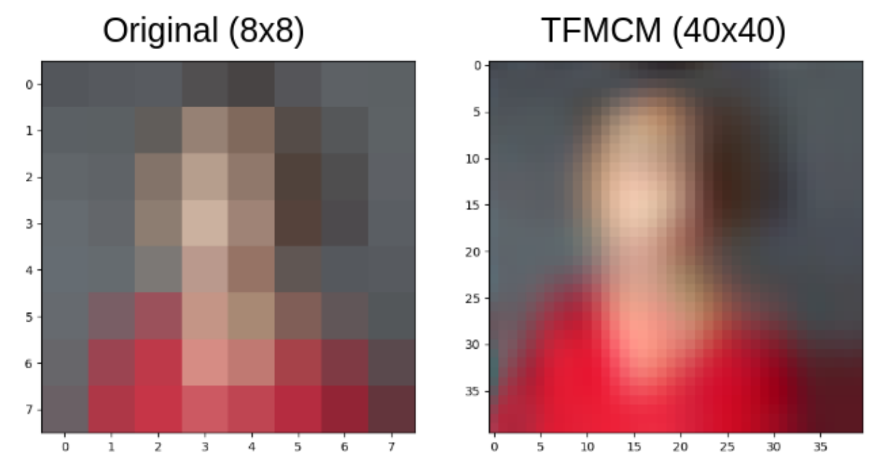



Among advanced ML techniques, graph-based optimization, feature selection, and learning play crucial roles in enhancing model performance. My undergraduate capstone project/thesis explores these concepts, focusing on methods such as Laplacian Minimal Complexity Machines (LapMCM) and Trend Filtering.

### 1. Introduction

Incorporating intrinsic geometric information of data into learning models can significantly improve their accuracy and generalization. By leveraging both labeled and unlabeled data, we can design more robust classifiers. This motivation leads us to explore manifold regularization and graph-based optimization techniques.

### 2. Manifold Regularization

Manifold regularization integrates intrinsic geometric structures into the learning process. The conventional learning framework is augmented with a manifold-based intrinsic norm, enhancing the model's ability to generalize from limited labeled data by utilizing the underlying data manifold.

### 3. Laplacian Minimal Complexity Machines (LapMCM)

LapMCM is an advanced semi-supervised learning technique that minimizes the Vapnik-Chervonenkis (VC) dimension, leading to a geometrically informed classifier. It incorporates both labeled and unlabeled data to optimize the decision boundary, reducing model complexity while maintaining high accuracy.

The optimization problem for LapMCM aims to minimize the classifier's complexity by solving the following objective function [(Jayadeva, 2015)](https://arxiv.org/pdf/1408.2803):


$$
\min_{h, \lambda, b, q} \dfrac{h^2}{2} + \dfrac{C}{2l}\sum^l_{i=1} q_i^2 + \dfrac{\gamma_A}{2} \lambda^TK\lambda + \dfrac{\gamma_l}{l+u} \lambda^TKLK\lambda
$$


Upon simplification, this implies an unconstrained optimization problem that can be solved iteratively using Newton's Method. Experiments demonstrate that LapMCM performs better than traditional methods like Support Vector Machines (SVMs) in various scenarios, especially with a limited number of labeled samples. It achieves higher accuracy with fewer support vectors, illustrating its efficiency.

#### 3.1 LapMCM Feature Selection through Unlabeled Data

LapMCM minimizes the VC dimension and the VC dimension in a case of spherized data is determined by the number of features, thus LapMCM minimizes features or does feature selection. The steps for feature selection are:
1. Train a linear LapMCM on data with large number of features and small number of samples
2. Train with a pair of labelled samples and all other as unlabelled samples
3. Select features with non-zero weights

LapMCM tends to select fewer features than ReliefF, FCBF [(Jayadeva, 2016)](https://www.sciencedirect.com/science/article/abs/pii/S092523121500939X) and still gives better performance measures which verifies the application of feature selection using unlabelled data.

|              Datasets           |         |         Features        |         |         |        |     Accuracies    |         |         |
|:-------------------------------:|:------:|:---:|:-------:|:----:|:------:|:---:|:-------:|:----:|
| **(samples X dimensions)** | **LapMCM** | **MCM** | **ReliefF** | **FCBF** | **LapMCM** | **MCM** | **ReliefF** | **FCBF** |
| Alon (62 × 2000)                |   25   |  41 |   896   | 1984 |  87%   | 83.8% | 82.2% | 82.1% |
| Shipp (77 × 7129)               |   35   |  51 |  3196   | 7129 |  97%   | 96.1% | 93.5% | 93.5% |
| Golub (72 × 7129)               |   67   |  47 |  2271   | 7129 |  96%   | 95.8% | 90.3% | 95.8% |
| Singh (102 × 12600)             |   66   |  81 |  5650   | 11619 |  91%   | 91.2% | 89.2% | 92.5% |
| Christensen (198 × 1413)        |  198   |  98 |   633   | 1413 |  99%   | 99.5% | 99.5% | 99.5% |

Table 1: LapMCM based feature selection. Accuracies from training and testing using SVM.

### 4. Trend Filtering

Graph Trend Filtering (GTF) [(Wang, 2016)](https://jmlr.org/papers/volume17/15-147/15-147.pdf) is a technique for smooth signal estimation on graphs. It extends traditional trend filtering to graph-structured data, offering advantages in terms of local adaptivity and computational efficiency.

Inspired by this, we came up with Trend Filtered MCM with the optimization problem:


$$
\min_{h, b, q, \alpha} h + \dfrac{1}{l}\sum^l_{i=1} q_i + \dfrac{\gamma_l}{l+u} ||\Delta K \lambda||_1
$$


where,  $\Delta$  is the Graph differenc operator.

TFMCM is advantageous over LapMCM:
1. Computational efficiency
2. Local adaptivity
3. Complex extensions

#### 4.1 Function Approximation by TFMCM

TFMCMs apply trend filtering principles to function approximation tasks, providing a robust framework for regression problems. This approach leverages the power of unlabeled data to improve model performance on complex manifolds.

#### 4.2 Super-Resolution using TFMCM

We first take the original low-resolution image with original 3D manifold shown in the 2nd part. We use the image pixels along with unlabelled intermediate pixels to learn a manifold which is shown as a scatter plot in the 3rd part of the image. This learned manifold is further used to predict intermediate pixel intensities and to resolve the image.

Our algorithm even gives better resolved generalizations as compared to methods like bilinear interpolation. Interpolation methods result into more diffused images while our algorithm gives more sharper results as illustrated.

We also used the algorithm on a 48 by 48 image and resolved it 5 times to a 240 by 240 image. Due to high computational costs, the images were super-resolved in parts of size 8 by 8. The image was divided into distinct frames of size 8 by 8 and each frame was parallely super-resolved to the size of 40 by 40. The resulting image too gives a better generalization and enhances features of the original image.

For colored images each of the R, B and the G channels were super-resolved parallely and were then cascaded and normalized (to avoid overflow), to create the output.

### 5. Future Work

1. Large scale extension of TFMCM: Develop an iterative solution for the TFMCM optimization problem, in the primal form.
2. Exhaustive exploration of the unlabelled samples based feature selection, as an individual research problem.

The thesis presentation slide deck can be found [here](BTP_Presentation.pdf).

The thesis dissertation report can be found [here](BTP.pdf).